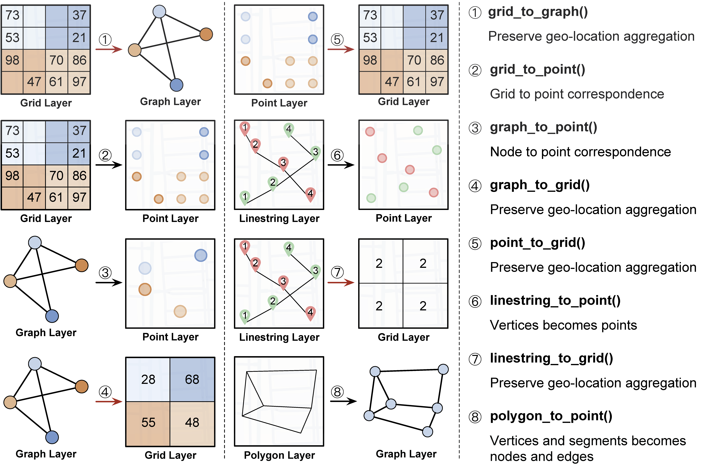

.. role:: red
    :class: red

.. role:: blue
    :class: blue

.. role:: green
    :class: green

.. raw:: html

    

UDL Transformation 
~~~~~~~~~~~~~~~~~~~

Overview
------------------

============================  ==============   ============================================================
Raw to Layer                   Returns         Description
============================  ==============   ============================================================
tif_to_grid()                   grid             Convert a TIFF file to a grid
csv_to_grid()                   grid             Convert a TIFF file to a grid
csv_to_graph()                  graph            Convert a tabular data to a graph
json_to_graph()                 graph            Convert a JSON file to a graph
csv_to_point()                  point            Convert a tabular data to a point
json_to_point()                 point            Convert a tabular data to a point
csv_to_linestring()             linestring       Convert a tabular data to a linestring
json_to_polygon()               polygon          Convert a tabular data to a polygon
============================  ==============   ============================================================

============================  ==============   ============================================================
Layer to Layer                 Returns         Description
============================  ==============   ============================================================
point_to_grid()                 grid            Transform the PointLayer data to GridLayer data by aggregating the points in the same grid cell
linestring_to_grid()            grid            Transform the LinestringLayer data to GridLayer data by counting the vertices in the same grid cell
polygon_to_grid()               grid            Transform the PolygonLayer data to GridLayer data by counting the vertices in the same grid cell
point_to_graph()                graph           Transform the PointLayer data to GraphLayer data by converting the points to nodes
polygon_to_graph()              graph           Transform the PolygonLayer data to GraphLayer data by converting the vertices to nodes and the segments to edges
grid_to_point()                 point           Transform the GridLayer data to PointLayer data by converting the grid cells to points
============================  ==============   ============================================================

.. note:: The PARAMETERS of the API are omitted due to the space limitation. More details can be found in the following sections.

Raw to Layer API
------------------

.. image:: ../img/Transformation.png
   :scale: 3%
   :align: center

``tif_to_grid(name, filedir, start_lat, end_lat, start_lon, end_lon, step_lat, step_lon, year=None, band=1, coord_type="latlon", mode="avg")``

| :blue:`PARAMETERS`:

- **name** (*string*) - Name of the layer
- **filedir** (*list[string]*) - The list of the path to the TIFF file
- **start_lat** (*float*) - Starting latitude
- **end_lat** (*float*) - Ending latitude
- **start_lon** (*float*) - Starting longitude
- **end_lon** (*float*) - Ending longitude
- **step_lat** (*float*) - Step of latitude
- **step_lon** (*float*) - Step of longitude
- **year** (*int*) - The year of dataset
- **band** (*int*) - The band of the TIFF file. Defaults to 1.
- **coord_type** (*string*) - Coordinate order type of tif file and the choice is "latlon" or "lonlat". Defaults to "latlon". The type can be revealed by ``get_coord_type`` (in utils).
- **mode** (*string*) - The way of aggregation. "sum", "avg", "max", "min" or "random". Defaults to "avg".

  + "avg"
  + "sum"
  + "max"
  + "min"
  + "random"
  
| :blue:`RETURNS`:

- Grid UDL object

.. code-block:: python

    from transformation import *
    nightlights_grid = tiff_to_grid("nightlights", ["data/nightlights.tif"], 30, 32.4, 0.01, 120, 122, 0.01, 2013, "max", "latlon", "avg")

``csv_to_grid(name, filedir, start_lat, end_lat, start_lon, end_lon, step_lat, step_lon, year=None, mode="avg")``

- **name** (*string*) - Name of the layer
- **filedir** (*string*) - Path to the tabular data file (CSV)
  
  The file should contain the following columns:

  + "latitude"
  + "longitude"
  + name
- **start_lat** (*float*) - Starting latitude
- **end_lat** (*float*) - Ending latitude
- **start_lon** (*float*) - Starting longitude
- **end_lon** (*float*) - Ending longitude
- **step_lat** (*float*) - Step of latitude
- **step_lon** (*float*) - Step of longitude
- **year** (*int*) - Year of the data
- **mode** (*string*) - The way of aggregation. "sum", "avg", "max", "min" or "random". Defaults to "avg".

  + "avg"
  + "sum"
  + "max"
  + "min"
  + "random"

| :blue:`RETURNS`:
  
- Grid UDL object

.. code-block:: python

    taxi_pick_grid = tab_to_grid("pick and drop.csv", "Pick up of Shanghai taxi", 30, 32.4, 0.01, 120, 122, 0.01, 2018, "sum")
  

``json_to_graph(name, filedir, year=None, directed=False, edge_attribute=None)``

| :blue:`PARAMETERS`:

- **name** - Name of the layer
- **filedir** - Path to the json data file (JSON)
  
  The json file should have the following format ("nightlights" is the name of the layer):

  .. code-block:: json

    {
      "nodes": [
          {
              "id": 1,
              "latitude": 31.2,
              "longitude": 121.4,
              "nightlight": 0.2
          },
          {
              "id": 2,
              "latitude": 31.3,
              "longitude": 121.5,
              "nightlight": 0.3
          }
      ],
      "edges": [
          {
              "source": 1,
              "target": 2,
              "weight": 1.2
          }
      ]
    }

- **year** (*int*)- The year of dataset
- **directed** (*bool*) - Whether the graph is directed. Defaults to False
- **edge_attribute** (*string*) - The attribute of the edge. Defaults to None

| :blue:`RETURNS`:
  
- Graph UDL object

.. code-block:: python

    roads_graph = json_to_graph("roads", "test/roadnet.json")

``csv_to_graph(name, filedir, year=None, attr=None, directed=False)``

| :blue:`PARAMETERS`:

- **name** (*string*) - Name of the layer
- **file** (*string*) - Path to the tabular data file (CSV)
  
  The file should contain the following columns:

  + "id" (also is the "source" node of the edge)
  + "latitude"
  + "longitude"
  + name (the attribute value of the node)
  + "target" (optional)
  + "weight" (optional)
- **year** (*int*) - Year of the data
- **attr** (*string*) - The attribute name of the edge. Defaults to None
- **directed** (*bool*) - Whether the graph is directed. Defaults to False
  
| :blue:`RETURNS`:
  
- Graph UDL object
  
``json_to_point(name, filedir, year=None)``

- **name** (*string*) - Name of the layer
- **filedir** (*string*) - Path to the JSON data file (JSON)
  
  The json file should have the following format ("nightlights" is the name in column_list, the key of the json file should be the same as the name in column_list):

  .. code-block:: json

    {
        "points": [
            {
                "latitude": 1.0,
                "longitude": 1.0,
                "nightlight": 0.2
            },
            {
                "latitude": 2.0,
                "longitude": 2.0,
                "nightlight": 0.3
            },
        ]
    }

- **year** (*int*) - Year of the data
  
| :blue:`RETURNS`:
  
- Point UDL object

``csv_to_linestring(name, filedir, sort_column, group_column=None, column_list=[], year=None)``

- **name** (*string*) - Name of the layer
- **filedir** (*string*) - Path to the tabular data file (CSV)
  
  The file should contain the following columns (the rest columns should be the element in column_list):

  + "latitude"
  + "longitude"
  + 

- **sort_column** (*string*) - The column name of the data to be sorted as the sequence of the linestring
- **group_column** (*string*) - The column name of the data to be grouped as the division of the linestring. If the column is None, the data will be a single linestring.
- **column_list** (*list[string]*) - The list of the column names of the data to be added as the attributes of the linestring
- **year** (*int*) - Year of the data
  
| :blue:`RETURNS`:
  
- Linestring UDL object

``json_to_polygon(name: str, filedir: str, year=None, column_list=[], output_dir=None, encoding="utf-8")``

- **name** (*string*) - Name of the layer
- **filedir** (*string*) - Path to the data file (JSON)
  
  The json file should have the following format (the rest keys should be the element in column_list):

  .. code-block:: json

    {
        "features": [
            {
                "type": "Feature",
                "geometry": {
                    "type": "Polygon",
                    "coordinates": [
                        [
                            [
                                120.992531,
                                30.955028
                            ],
                            [
                                120.991683,
                                30.958211
                            ]
                        ]
                    ]
                },
            }
        ]
    }
  
- **year** (*int*) - Year of the data
- **column_list** (*list[string]*) - The list of the column names of the data to be added as the attributes of the polygon
  
| :blue:`RETURNS`:
  
- Polygon UDL object
  

Layer to Layer API
------------------------------------

``point_to_grid(point_data, target_name=None, start_lat, end_lat, step_lat, start_lon, end_lon, step_lon, mode="avg")``

| :blue:`PARAMETERS`:

- **point_data** (*PointLayer*) - The point data to be transformed
- **target_name** (*string*) - The name of the grid transformed to
- **start_lat** (*float*) - Starting latitude
- **end_lat** (*float*) - Ending latitude
- **step_lat** (*float*) - The step of latitude of the grid
- **start_lon** (*float*) - Starting longitude
- **end_lon** (*float*) - Ending longitude
- **step_lon** (*float*) - The step of longitude of the grid
- **mode** (*string*) - The way of aggregation. "sum", "avg", "max", "min" or "random". Defaults to "avg".

  + "avg"
  + "sum"
  + "max"
  + "min"
  + "random"

| :blue:`RETURNS`:
  
- Grid UDL object

``linestring_to_grid(linestring_data, target_name=None, start_lat, end_lat, step_lat, start_lon, end_lon, step_lon)``

| :blue:`PARAMETERS`:

- **linestring_data** (*LinestringLayer*) - The linestring data to be transformed
- **target_name** (*string*) - The name of the grid transformed to
- **start_lat** (*float*) - Starting latitude
- **end_lat** (*float*) - Ending latitude
- **step_lat** (*float*) - The step of latitude of the grid
- **start_lon** (*float*) - Starting longitude
- **end_lon** (*float*) - Ending longitude
- **step_lon** (*float*) - The step of longitude of the grid

| :blue:`RETURNS`:
  
- Grid UDL object

``polygon_to_grid(polygon_data, target_name=None, start_lat, end_lat, step_lat, start_lon, end_lon, step_lon)``

- **polygon_data** (*PolygonLayer*) - The polygon data to be transformed
- **target_name** (*string*) - The name of the grid transformed to
- **start_lat** (*float*) - Starting latitude
- **end_lat** (*float*) - Ending latitude
- **step_lat** (*float*) - Difference of latitude between each cell 
- **start_lon** (*float*) - Starting longitude
- **end_lon** (*float*) - Ending longitude
- **step_lon** (*float*) - Difference of lontitude between each cell

| :blue:`RETURNS`:
  
- Grid UDL object

``point_to_graph(point_data, target_name=None, directed=False, edge_attribute=None, edge_weight=None)``

| :blue:`PARAMETERS`:

- **point_data** (*PointLayer*) - The point data to be transformed
- **target_name** (*string*) - The name of the grid transformed to
- **directed** (*bool*) - Whether the graph is directed. Defaults to False
- **edge_attribute** (*string*) - The attribute name of the edge. Defaults to None
- **edge_weight** (*list*) - The attribute value of the edge weight. Defaults to None

| :blue:`RETURNS`:
  
- Graph UDL object

``polygon_to_graph(polygon_data, target_name=None, edge_attribute=None, edge_weight=None)``

| :blue:`PARAMETERS`:

- **polygon_data** (*PolygonLayer*) - The polygon data to be transformed
- **target_name** (*string*) - The name of the grid transformed to
- **edge_attribute** (*string*) - The attribute name of the edge (should be the attribute in polygon data's features). Defaults to None
- **edge_weight** (*list*) - The attribute value of the edge weight. If the edge_attribute is specified, the edge_weight defaults to the value of the edge_attribute. Otherwise, the edge_weight defaults to None

| :blue:`RETURNS`:
  
- Graph UDL object

``grid_to_point(grid_data, target_name=None, start_lat=None, end_lat=None, step_lat=None, start_lon=None, end_lon=None, step_lon=None)``

| :blue:`PARAMETERS`:

- **grid_data** (*GridLayer*) - The grid data to be transformed
- **target_name** (*string*) - The name of the point transformed to
- **start_lat** (*float*) - Starting latitude
- **end_lat** (*float*) - Ending latitude
- **step_lat** (*float*) - The step of latitude of the grid
- **start_lon** (*float*) - Starting longitude
- **end_lon** (*float*) - Ending longitude
- **step_lon** (*float*) - The step of longitude of the grid

| :blue:`RETURNS`:

- Point UDL object

..
 ``grid_granularity_convert(grid_data, target_name=None, target_lat_step, target_lon_step, start_lat, end_lat, start_lon, end_lon)``
 | :blue:`PARAMETERS`:
  - **grid_data** (*GridLayer*) - The original grid data to be converted
  - **target_name** (*string*) - Name of the target grid data
  - **target_lat_step** - Step of latitude in the target grid data
  - **target_lon_step** - Step of longitude in the target grid data
  - **start_lat** - Starting latitude in the target grid data
  - **end_lat** - Ending longitude in the target grid data
  - **start_lon** - Starting longitude in the target grid data
  - **end_lon** - Ending longitude in the target grid data

..
 ``grid_merge(grid_data1, grid_data2, target_name=None, aggregation)``
 Two merged grids should have the same granularity.
..
    | :blue:`PARAMETERS`:

    - **grid_data1** (*GridLayer*) - The first grid data to be merged
    - **grid_data2** (*GraphLayer*) - The second grid data to be merged
    - **target_name** (*string*) - The name of the merged grid
    - **aggregation** (*string/function*) - Agregation method, including:

    + "sum"
    + "average"
    + "max"
    + "min"
    + other user-defined aggregation methods

    | :blue:`RETURNS`:
    
    - Grid UDL object

    .. give a specific example of the aggregation function

    ``graph_align(graph_data1, graph_data2, target_name=None, start_lat, end_lat, start_lon, end_lon)``

    ``graph_merge(graph_data1, graph_data2, target_name=None, start_lat, end_lat, start_lon, end_lon, aggregation)``

    - **graph_data1** (*GraphLayer*) - The first graph data to be merged
    - **graph_data2** (*GraphLayer*) - The second graph data to be merged
    - **target_name** (*string*) - The name of the merged graph
    - **start_lat** - Starting latitude
    - **end_lat** - Ending latitude
    - **start_lon** - Starting longitude
    - **end_lon** - Ending longitude
    - **aggregation** (*string/function*) - Agregation method, including:

    + "sum"
    + "average"
    + "max"
    + "min"
    + other user-defined aggregation methods

    | :blue:`RETURNS`:

    - Graph UDL object

